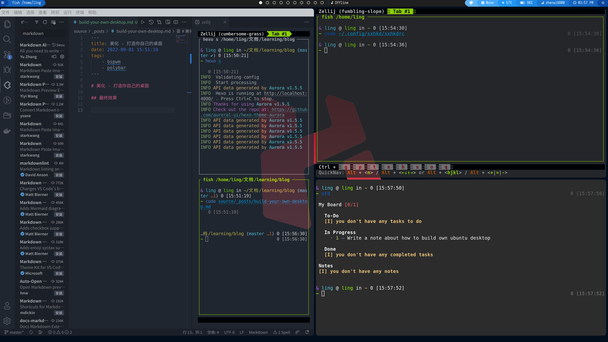

# 美化 - 打造你自己的桌面

## 依赖

- bspwm
- polybar

## 安装bspwm

> https://github.com/yorkox0/autoBspwm 自动安装bspwm

```shell
git clone https://github.com/yorkox0/autoBspwm
cd autoBspwm/
python3 main.py
```

## 安装polybar主题

> https://github.com/adi1090x/polybar-themes polybar主题包

```shell
$ git clone --depth=1 https://github.com/adi1090x/polybar-themes.git
$ cd polybar-themes
$ chmod +x setup.sh

$ ./setup.sh

[*] Installing Polybar Themes...

[*] Choose Style -
[1] Simple
[2] Bitmap

[?] Select Option : 1

[*] Installing fonts...
[*] Creating a backup of your polybar configs...
[*] Successfully Installed.
```

## 最终效果

