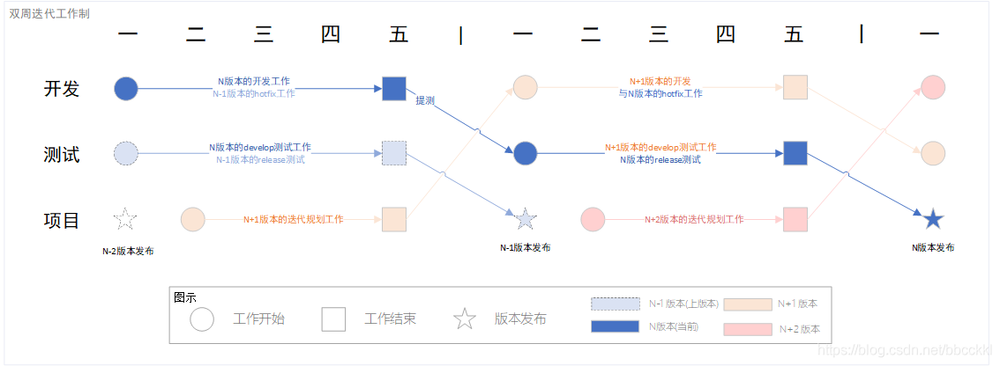

# Cloud Git Flow

## Current Problems

1. 分支名不规范,无法确定哪些分支可以清理，哪些不可以清理
2. 发布版本时经常有合并困难和冲突
3. 线上环境多，有时难以定位问题代码分支
4. 现有分支管理策略，在修复线上问题时需要同时向至少两个分支提交代码(且存在base不同的风险)
5. 并行开发的同时，各个分支需要发布时间节点不同，导致需要向release分支提交保证之后合并顺利

## Related Work

### Git Flow

1. Master 分支： 对应生产环境，稳定的代码
2. HotFix 分支:  线上bug修缮用的分支，每次修改线上代码的bug时都要用hotfix来维护，完成后向Developer和Master同时合并。完成后删除分支。
3. Release 分支： 预发分支，做发布前的准备工作，对应的是预发环境。这个分支可以确保们开发继续向前，不会因为要发布不而被停滞住。一旦Release分支达到了可发布的状态，我们需要把Release分支同时向Master，Developer分支上合并，保持代码的一致性，然后把Release分支删除。
4. Developer 分支： 开发分支， 一旦Feature分支内功能开发完成就将Feature中的代码合并到Developer分支中，合并完成后，删除该功能分支。这个分支对应的是集成测试环境。
5. Feature 分支： 功能分支，用于开发功能（需求），用于开发环境

#### Pros

1. 满足复杂发布规则

#### Cons

1. Master和Developer分支需要长期维护
2. Release分支和HotFix分支的操作复杂，容易错误。 

### Gitlab Flow

建立对应环境分支，只有在上游环境采纳的代码才能合并进下游分支。

同时对于版本发布情况，需要建立对应版本分支，之后的fix都合并进入这个版本分支。

#### Pros

1. 理解简单

#### Cons

1. 如果需要进行特定功能发布，则需要从上游分支cherry-pick出特定commit进入下游

### Double Week Sprint Flow (双周迭代)

更多的是一种职能分工

双周迭代制，即一个冲刺迭代设置为两周（或若干周），在这两周中的第一周，这几位垂直职能角色可以如下分工：

N为当前周，则N-1为上周,N+1为下周

开发：进行N迭代 (当前迭代) 的开发与N-1版本 (上个版本) 的hotfix工作，并在每周五进行统一提测；

测试：进行N迭代 (当前迭代) 的develop环境测试与N-1迭代 (上个迭代) 的 release 环境测试，在每周五前完成N-1版本的测试工作；

项目：进行N+1 (下个迭代) 的迭代规划工作与上两个迭代(N-2)的迭代发布工作

#### Pros

1. 增加分支的职能体现

#### Cons

1. 和Gitlab flow一样不能处理复杂情况

## Our Flow

