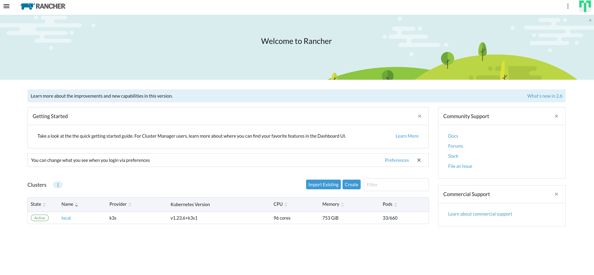

# Gitops Best Practice

## Pre-requisuites

- a kubernetes cluster

## Optional

- rancher 集群管理界面
- kubevious 集群管理界面

## Requirements

- gitlab 仓库
- harbor 镜像仓库
- tekton 流水线
- argo rollout 渐进式
- istio 网关

## Rancher (不推荐，容易崩溃，界面老旧)

可视化集群管理界面

### Installation

```shell
helm repo add rancher-latest https://releases.rancher.com/server-charts/latest

kubectl create namespace cattle-system

kubectl apply -f https://github.com/cert-manager/cert-manager/releases/download/v1.7.2/cert-manager.crds.yaml

helm repo add jetstack https://charts.jetstack.io

helm repo update

helm install cert-manager jetstack/cert-manager \
  --namespace cert-manager \
  --create-namespace \
  --version v1.7.1

helm install rancher rancher-latest/rancher \
  --namespace cattle-system \
  --set hostname=rancher.sslip.io \
  --set replicas=1 \
  --set bootstrapPassword=password
```

将`rancher.sslip.io`注册进dns中，打开浏览器进行访问.



## Gitlab

可自托管git版本控制系统

### Installation

```shell
helm repo add gitlab https://charts.gitlab.io/
helm install -n gitlab --create-namespace gitlab gitlab/gitlab --set certmanager.email=email@example.com
```

### Root Inital Secret

```
kubectl get -n gitlab secret  
```