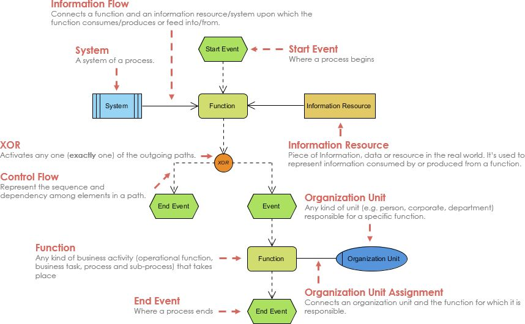

# 事件流程链（EPC）建模指南

## 什么是EPC?

EPC全称事件驱动流程链Event-driven Process Chain，是在1990年代初期由萨尔兰德大学的Wilhelm-August Scheer教授在ARIS框架内开发的。EPC认为流程是由一系列事件触发的，并且针对事件的行为又将引发新的事件。因此，流程通常是事件-功能-事件的形式。

EPC 模型通过将业务过程中的静态资源（系统、组织、数据等）组织在一起形成一个能够完成特定任务或者流程的动态模型。

EPC流程图比较合适描述那些有严密过程控制和结果导向的流程。作为一种流程建模标准，只要满足这些规则限制，则能确保流程图的正确、表意清晰，从而指导业务开展。

## EPC组件说明

### 事件（Event）

事件是环境的一种特定状态，当环境改变到这种状态时，相应的流程就被触发了。通常也可以理解为现实世界的事物的某种状态的改变，用六边形表示，常见的三种情况：

能触发某个流程开始的外部改变（比如：客户订单到达）
流程内部处理状态的改变（比如：产品制造完毕）
带来外部影响的结果（比如：订单送到客户手中）
使用要点：

事件可以是某人为事件或者是计算机系统操作的结果；
事件通常采用主谓结构词组描述，比如：订单到达、成本计算完成；

### 功能（Function）

功能表示业务流程中的某个行为或者完成特定任务的活动。用圆角矩形表示。

使用要点：

通常，流程中的每一个活动都应该是一个增值过程；
功能可能由人或者计算机系统完成；
每一个功能都包含有输入，经过处理创造输出；
功能的描述，通常采用动宾短语来表示，比如：输入订单、计算成本，应当避免使用模糊的单个动词来表达。

### 规则（Logical Connectors）

或者直接翻译为逻辑连接，包括：与（AND）、或（OR）、异或（XOR）。

与（AND）同时激活流程中的所有路径，用“Λ”表示。

或（OR）激活流程中的一个或多个路径，用“V”表示。

异或（XOR）同一时间仅激活流程中的一条路径，用“XOR”表示。

### 信息/资源（Information Resource）

信息/材料代表来⾃现实世界的信息、材料或资源对象，它们可以是功能的输入，也可以是功能的输出。用矩形表示。

### 组织单位（Organization Unit）

组织单位意愿决定了企业结构中的哪个⼈或组织负责的特定职能。

### 流程路径（Process Path）

流程路径形状显⽰与其他流程的连接。

### 系统 （System）

承载某一流程的信息系统。

### 流（Flow）、分配（Assignment）

流（Flow）包含信息流（Information Flow）和控制流（Control Flow），前者用于系统、数据和功能之间的连接，表达信息的输入输出，后者用于事件、功能之间的连接，表达事件行为之间的驱动关系。

在有的工具中，用带箭头的实线和虚线区分了信息流和控制流的表达，但是也有的工具中并没有进行这样的区分。

分配（Assignment）用于功能、组织单位之间的连接，用不带箭头的实线表示。

## EPC建模注意点

一般注意点
- 每个事件驱动的流程链的开始和结束总是由一个事件来说明。
- 每一个模型必须至少包含有一个开始事件和一个结束事件。
- 功能与事件总是交替着出现。
- 时间和功能永远只有一个输入和一个输出连接。
- 流程路径使用规则进行分离与合并。
- 功能的多事件触发也是通过规则表达。
- 避免在事件之后使用OR和XOR，尽量使用功能来作出决策。
- 凡是做出了某种决策的功能，后面总是紧跟着规则。
- 通过规则体现某个决策之后的各种可能路径。
- 紧跟在规则之后的事件，体现了决策的一种可能结果。
- 规则不能同时有多个输入和输出。
- 尽量避免组合使用规则，这样会难以理解。
- 在功能之后，除非清楚知道多分支结果事件会同时发生才用OR，否则尽量采用XOR。
- 分支和合并通常使用同一个规则，如果要合并分支，在事件之后合并会更容易理解。

规则注意点
- 每个事件可以跟随多个功能，也可以每个功能跟随多个事件，但两者之间存在规则。

## 案例

### 铁路货运流程链

### 订单流程链

